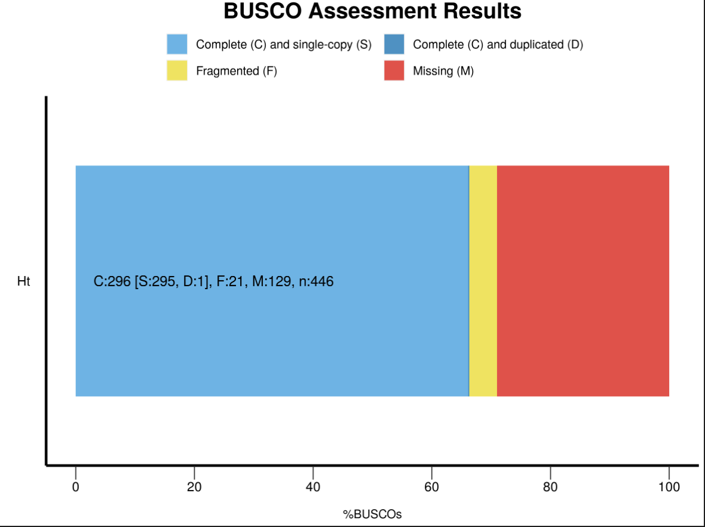
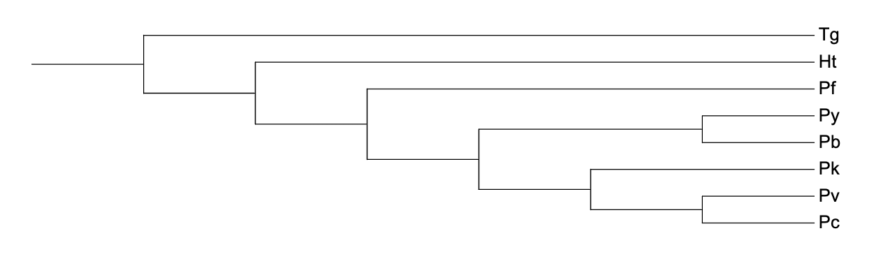

# BINP29_Malaria 
## Loaded software in different environments 
* proteinortho version 6.3.1 ~/miniconda3/envs/malaria/bin/proteinortho
* busco version 5.6.1 ~/miniconda3/envs/busco/bin/busco
* clustalo version 1.2.4 ~/miniconda3/envs/clustalo/bin/clustalo
* raxmlHPC version 8.2.12 ~/miniconda3/envs/clustalo/bin/raxmlHPC
* biopython version 1.78 is installed in the conda biopython environment
* python version 3.12.2 is installed in the conda biopython environment
* numpy version 1.26.4 is installed in the conda biopython environment
* pandas version 2.2.1 is installed in the conda biopython environment

#### Q1. Do you think that in a phylogenetic tree the parasites that use similar hosts will group together? 
In phylogenetic trees, the grouping of parasites that use similar hosts can occur, but it's not guaranteed. The evolutionary relationships depicted in a phylogenetic tree are based on similarities in genetic sequences or other traits, which may or may not be directly related to host specificity.
Host jump events can occur, where a parasite species switches to a new host species. This can lead to the parasites that use similar hosts not grouping together in the phylogenetic tree.
## Malaria project directory
```bash
mkdir malaria
## Obtain all the necessary files
cp /resources/binp29/Data/malaria/plasmodiumGenomes.tgz .
tar -xvzf plasmodiumGenomes.tgz
## Installation of GeneMark
scp -r /Users/med-snt/Downloads/gm_key_64/ inf-51-2023@bioinf-serv2.cob.lu.se:/home/inf-51-2023/
## Check the key 
ls ~/.gm_key
```

## Gene prediction for *Plasmodium berghei*
```bash
mkdir p_berghei
### P.berghei is very fragmented, so lowering the minimum contig length to 10000
nohup gmes_petap.pl --ES --sequence /home/inf-51-2023/malaria/Plasmodium_berghei.genome --min_contig 10000 &
jobs
top -u inf-51-2023
```

## Haeomoproteus_tartakovskyi (Obtaining the bird genome)
```bash
cp /resources/binp29/Data/malaria/Haemoproteus_tartakovskyi.raw.genome.gz .
gunzip Haemoproteus_tartakovskyi.raw.genome.gz

# Obtain the removeScaffold.py script
cp /resources/binp29/Data/malaria/removeScaffold.py .
```

## 01_Directory for the output of scaffold removal
```bash
mkdir 01_remove_scaffold_h_tartakovskyi
chmod +x removeScaffold.py
# removeScaffold (sequences with a GC content of 32% or less will be included in the output, remove scaffold length < 3000)
# 32% was choosen based on the graph of the GC content of the parasite and the bird (Dag's lecture)
./removeScaffold.py /home/inf-51-2023/malaria/Haemoproteus_tartakovskyi.raw.genome 32 Ht.genome 3000 # Ht.genome is the output file
```
## Gene prediction
```bash
nohup gmes_petap.pl --ES --sequence Ht.genome --min_contig 10000 &
```
#### With the new genome file, make a gene prediction. You will probably still have some scaffolds that derive from the bird. These should be short.
#### Q2. Why?
I use less stringent filtering, applying only GC content 32% or less removed bird genome, will still have some scaffolds that derive from the bird.

GeneMark is a family of gene prediction programs. GeneMark programs use statistical models to predict gene locations. These models are trained on known genes from the same or related organisms to learn the patterns that indicate the presence of a gene.

gffParse: The program retrieves the nucleotide sequences from the fasta input file based on the positions in the gff or gtf file for a particular feature. If wanted these are translated (only with the standard code). Attributes in the gff-file are seperated by semicolons. The script looks for the specified tag set by -a and hopefully retrieves the correct identifier.

Usage:         gffParse.pl -i fasta_file -g gff_file [-b basename]
                [-d directory] [-f feature] [-a attribute] 
                [-p] [-s] [-l] [-F] [-Q] [-v] [-h]

Output files:  basename.fna, basename.log and optionally basename.faa, basename.report and basename.length.

#### Question: Which of the two programs, in your opinion, is to blame? 
*If the gtf file is not in the correct format, the program will not work*

## Remove the GC content from the gtf file
```bash
cat genemark.gtf | sed "s/ GC=.*\tGeneMark.hmm/\tGeneMark.hmm/" > Ht2.gff 
gffParse.pl -i /home/inf-51-2023/malaria/01_remove_scaffold_h_tartakovskyi/Ht.genome -g /home/inf-51-2023/malaria/01_remove_scaffold_h_tartakovskyi/Ht2.gff -f CDS -b h_tartakovskyi -c -p -a gene_id -F
# See above for gffparse usage
````
## 02_Keep the fasta files produced by gffParse for Ht2.gff and run blastx and blastp
```bash
mkdir 02_fasta 
cp /resources/binp28/Data/gffParse.pl . # (local server bin)
# add chmod to make it executable
chmod +x gffParse.pl
gffParse.pl -h
# -i to specify the input file, -g to specify the gtf file, -f to specify the feature, -b to specify the bin, -p to specify the prefix, -a to specify the attribute
```
### Use SwissProt as the database for the blast searches
```bash
nohup blastx -query h_tartakovskyi.fna -db SwissProt -num_threads 8 -out blastx.out & # -query to specify the query file, -db to specify the database, -outfmt to specify the output format, -num_threads to specify the number of threads, -out to specify the output file
# This -outfmt will produce a tab output format
nohup blastp -query h_tartakovskyi.faa -db SwissProt -outfmt 6 -num_threads 8 -out blastp.out & # -query to specify the query file, -db to specify the database, -outfmt to specify the output format, -num_threads to specify the number of threads, -out to specify the output file
```

For example: SEY1_PLAKH
In SwissProt, the five characters after the underscore is a species abbreviation (Organism name: Plasmodium knowlesi (strain H)). SEY1, is the protein name, which is before the underscore

## 03_Compare the results of the blastp and blastx searches using taxo
```bash
mkdir 03_scaffold
# NCBI taxonomy file (wget ftp://ftp.ebi.ac.uk/pub/databases/taxonomy/taxonomy.dat)
# Create a symbolic link to the taxonomy.dat file 
ln -s /resources/binp29/Data/malaria/taxonomy.dat taxonomy.dat
# Latest release of SwissProt dat file (wget ftp://ftp.uniprot.org/pub/databases/uniprot/current_release/knowledgebase/complete/uniprot_sprot.dat.gz)
# Create a symbolic link to the uniprot_sprot.dat file
ln -s /resources/binp29/Data/malaria/uniprot_sprot.dat uniprot_sprot.dat
ls -l
cp /resources/binp29/Data/malaria/datParser.py . # (local server bin)
```
### Run the datParser.py, use taxo to get the taxonomy of the species, uniprot_sprot.dat to get the protein names
```bash
python datParser.py /home/inf-51-2023/malaria/02_fasta/blastx.out /home/inf-51-2023/malaria/02_fasta/h_tartakovskyi.fna taxonomy.dat uniprot_sprot.dat > scaffold.dat
# Clean up the bird contigs
# Remove the bird contigs from the 01_remove_scaffold_h_tartakovskyi/Ht.genome file using the scaffold.dat file
```
### Write a script to remove the bird contigs from the genome file

### Script bird_contig.py
```python
# Read the contig IDs from the scaffold.dat file into a set
with open("../03_scaffold/scaffold.dat", "r") as f:
    unwanted_contig_ids = set(line.strip() for line in f)

# Read the Ht.genom file and write only the contigs not in scaffold.dat to a new file
with open("../01_remove_scaffold_h_tartakovskyi/Ht.genom", "r") as f, open("Ht.genom_filtered", "w") as out_f:
    write_contig = True
    for line in f:
        if line.startswith(">"):
            contig_id = line.split()[0][1:]  # Remove the ">" prefix
            if contig_id in unwanted_contig_ids:
                write_contig = False
            else:
                write_contig = True
                out_f.write(line)
        elif write_contig:
            out_f.write(line)
```
#### Q3 Total length of the genome
```bash
awk -vRS=">" -vFS="\n" 'BEGIN {num_seq=0; tot_len=0} NF > 1 {print $1; num_seq+=1; seq_len=0; for(i=2; i<=NF; i++) seq_len+=length($i); print "Sequence length:", seq_len, "\n"; tot_len+=seq_len} END {print "### INFO ###", "\nNumber of sequences:", num_seq, "\nTotal length:", tot_len, "\nAverage length:", tot_len/num_seq, "\n"}' Plasmodium_berghei.genome
```
#### Total genes, example:
```bash
nohup gmes_petap.pl --ES --sequence /home/inf-51-2023/malaria/Haemoproteus_tartakovskyi.raw.genome --min_contig 10000 &
# Tg total genes
cat Tg.gff | head -4
cat Tg.gff | tail -4
# Total genes for other species, example:
cat fixed_Pk.gtf | cut -f3 | sort | uniq -c
```
#### Total GC content, example:
```bash
stats.sh Plasmodium_berghei.genome
```
#### Q3. # Species,    Host,    Genome size,     Genes,   Genomic GC
* 1 Plasmodium berghei, rodents,  17954629,    7235,    23.7%
* 2 Plasmodium cynomolgi, macaques,   26181343,    5787,    40.4%
* 3 Plasmodium falciparum, humans,    23270305,    5270,    19.4%
* 4 Plasmodium knowlesi, lemures, 23462187,    4952,    38.8%
* 5 Plasmodium vivax, humans, 27007701,    5682,    42.3%
* 6 Plasmodium yoelii, rodents,   22222369,    4889,    21.8%
* 7 Haemoproteus tartakovskyi, birds, 27426784,    6807,    27.4%    
* 8 Toxoplasma gondii, humans,    128105889,   15.8k,   52.4% 

#### Q4 Compare the genome sizes with other eukaryotes and bacteria. Discuss with your partner (that is student partner) the reason for the observed genome sizes.
Potential Reasons for Genome Size Differences: Host Range and Complexity, Gene Content and Redundancy, Evolutionary History

#### Q5 What may cause the biased GC-contents in some of the species
The biased GC contents observed in the listed species are likely the result of complex interactions between environmental factors, evolutionary processes, and genomic features specific to each parasite species.

## 04_store clean scaffolds
```bash
mkdir 04_cleaned_sf
python bird_contig.py 

# Check if the bird contigs are removed, for example:
cat Ht.genom_filtered | grep "contig00001" 

# Count the number of sequences, total length, and average length of the genome
# original Ht.genom file
awk -vRS=">" -vFS="\n" 'BEGIN {num_seq=0; tot_len=0} NF > 1 {print $1; num_seq+=1; seq_len=0; for(i=2; i<=NF; i++) seq_len+=length($i); print "Sequence length:", seq_len, "\n"; tot_len+=seq_len} END {print "### INFO ###", "\nNumber of sequences:", num_seq, "\nTotal length:", tot_len, "\nAverage length:", tot_len/num_seq, "\n"}' Ht.genome
# Number of sequences: 2322 
# Total length: 17479260 
# Average length: 7527.67 

# Ht.genom_filtered file
awk -vRS=">" -vFS="\n" 'BEGIN {num_seq=0; tot_len=0} NF > 1 {print $1; num_seq+=1; seq_len=0; for(i=2; i<=NF; i++) seq_len+=length($i); print "Sequence length:", seq_len, "\n"; tot_len+=seq_len} END {print "### INFO ###", "\nNumber of sequences:", num_seq, "\nTotal length:", tot_len, "\nAverage length:", tot_len/num_seq, "\n"}' Ht.genom_filtered
# Number of sequences: 2289 
# Total length: 17066874 
# Average length: 7456.04 
```
### Gene prediction using genemark for the blast filtered genome
```bash
nohup gmes_petap.pl --ES --sequence Ht.genom_filtered --min_contig 10000 &
# change to gff file by removing the GC content
cat genemark.gtf | sed "s/ GC=.*\tGeneMark.hmm/\tGeneMark.hmm/" > Ht2_filtered.gff 
```
### gffParse
```bash
gffParse.pl -i Ht.genom_filtered -g Ht2_filtered.gff -f CDS -b h_tartakovskyi_filtered -c -p -a gene_id -F
```
## 05_To identify the orthologous genes in the different species, we will use the proteinortho program.
```bash
mkdir 05_proteinortho

# proteinortho installation
conda install -c bioconda proteinortho
# manual of proteinortho
# https://gitlab.com/paulklemm_PHD/proteinortho#readme

# Obtain the proteinortho input files
cp /resources/binp29/Data/malaria/Tg.gff.gz .
gunzip Tg.gff.gz

cd /tmp/Prediction/
cp /tmp/Prediction/genemark.Pc.gtf /tmp/Prediction/genemark.Pk.gtf  /tmp/Prediction/fixed_Pk.gtf  /tmp/Prediction/genemark.Pb.gtf  /tmp/Prediction/genemark.Pv.gtf  /tmp/Prediction/genemark.Pf.gtf .
# use my own Pb file
cp /home/inf-51-2023/malaria/p_berghei/genemark.gtf .
```
### Change to gff file for other species if needed
```bash
cat fixed_Pk.gtf | sed "s/ GC=.*\tGeneMark.hmm/\tGeneMark.hmm/" > Pk.gff 
cat genemark.Pb_hm.gtf | sed "s/ GC=.*\tGeneMark.hmm/\tGeneMark.hmm/" > Pb.gff
cat genemark.Pf.gtf | sed "s/ GC=.*\tGeneMark.hmm/\tGeneMark.hmm/" > Pf.gff
cat genemark.Py.gtf | sed "s/ GC=.*\tGeneMark.hmm/\tGeneMark.hmm/" > Py.gff
cat genemark.Pv.gtf | sed "s/ GC=.*\tGeneMark.hmm/\tGeneMark.hmm/" > Pv.gff
cat genemark.Pc.gtf | sed "s/ GC=.*\tGeneMark.hmm/\tGeneMark.hmm/" > Pc.gff
```
### Fix the *Plasmodium knowlesi* genome file, remove the second header (manually on vscode)

## gffParse
```bash
gffParse.pl -i Ht.genom_filtered -g Ht2_filtered.gff -f CDS -b h_tartakovskyi_filtered -c -p -a gene_id -F
gffParse.pl -i ../Plasmodium_knowlesi.genome -g Pk.gff -f CDS -b Pk_fil -c -p -a gene_id -F 
gffParse.pl -i ../Plasmodium_berghei.genome -g Pb.gff -f CDS -b Pb_fil -c -p -a gene_id -F
gffParse.pl -i ../Plasmodium_faciparum.genome -g Pf.gff -f CDS -b Pf_fil -c -p -a gene_id -F
gffParse.pl -i ../Plasmodium_yoelii.genome -g Py.gff -f CDS -b Py_fil -c -p -a gene_id -F
gffParse.pl -i ../Plasmodium_vivax.genome -g Pv.gff -f CDS -b Pv_fil -c -p -a gene_id -F
gffParse.pl -i ../Toxoplasma_gondii.genome -g Tg.gff -f CDS -b Tg_fil -c -p -a gene_id -F
gffParse.pl -i ../Plasmodium_cynomolgi.genome -g Pc.gff -f CDS -b Pc_fil -c -p -a gene_id -F
```
*Keep only the id in the header (otherwise, the proteinortho program will not work)*
```bash
awk '/^>/ {print $1; next} { print $0}' Pb_fil.faa  > Pb_filNoH.faa
awk '/^>/ {print $1; next} { print $0}' Pc_fil.faa  > Pc_filNoH.faa
awk '/^>/ {print $1; next} { print $0}' Pf_fil.faa  > Pf_filNoH.faa
awk '/^>/ {print $1; next} { print $0}' Pk_fil.faa  > Pk_filNoH.faa
awk '/^>/ {print $1; next} { print $0}' Pv_fil.faa  > Pv_filNoH.faa
awk '/^>/ {print $1; next} { print $0}' Py_fil.faa  > Py_filNoH.faa
awk '/^>/ {print $1; next} { print $0}' Tg_fil.faa  > Tg_filNoH.faa
awk '/^>/ {print $1; next} { print $0}' h_tartakovskyi_filtered.faa  > h_tartakovskyi_filteredNoH.faa
```

#### Q6. What does the curly braces notation stand for?
The curly braces notation `{}` in the command line is a form of brace expansion. It generates arbitrary strings. It is a mechanism by which arbitrary strings may be generated. This mechanism is most often used with filename or command arguments.
```bash
nohup proteinortho6.pl {Ht,Pb,Pc,Pf,Pk,Pv,Py,Tg}.faa & 

# actual command get executed:
nohup proteinortho6.pl ../04_cleaned_sf/h_tartakovskyi_filteredNoH.faa Pb_filNoH.faa Pc_filNoH.faa Pf_filNoH.faa Pk_filNoH.faa Pv_filNoH.faa Py_filNoH.faa Tg_filNoH.faa &   
```
## 06_Run the busco program on the gene predictions
```bash
mkdir 06_busco
```
#### What does the flag -l stands for? and why do we choose apicomplexa?
-l to specify the lineage, we choose apicomplexa because we are working with apicomplexan parasites, examples:
```bash
busco -i ../05_gene_prediction/Pb_fil.faa -o Pb -m prot -l apicomplexa -c 24 # -o to specify the output file, -m to specify the mode, -l to specify the lineage
busco -i ../05_gene_prediction/Pc_fil.faa -o Pc -m prot -l apicomplexa -c 24 # -o to specify the output file, -m to specify the mode, -l to specify the lineage
busco -i ../05_gene_prediction/Pf_fil.faa -o Pf -m prot -l apicomplexa -c 24 # -o to specify the output file, -m to specify the mode, -l to specify the lineage
busco -i ../05_gene_prediction/Pk_fil.faa -o Pk -m prot -l apicomplexa -c 24 # -o to specify the output file, -m to specify the mode, -l to specify the lineage
busco -i ../05_gene_prediction/Pv_fil.faa -o Pv -m prot -l apicomplexa -c 24 # -o to specify the output file, -m to specify the mode, -l to specify the lineage
busco -i ../05_gene_prediction/Py_fil.faa -o Py -m prot -l apicomplexa -c 24 # -o to specify the output file, -m to specify the mode, -l to specify the lineage
busco -i ../04_cleaned_sf/h_tartakovskyi_filtered.faa -o Ht -m prot -l apicomplexa -c 24 # -o to specify the output file, -m to specify the mode, -l to specify the lineage         
# Ht (C:66.3%[S:66.1%,D:0.2%],F:4.7%,M:29.0%,n:446)
```
I tried Aconoidasida for Ht (C:58.1%[S:58.1%,D:0.0%],F:5.4%,M:36.5%,n:1135)
```bash
busco -i ../04_cleaned_sf/h_tartakovskyi_filtered.faa -o Ht_aco -m prot -l aconoidasida -c 24 # -o to specify the output file, -m to specify the mode, -l to specify the lineage
```
I tried Plasmodium for Ht (C:38.1%[S:38.1%,D:0.0%],F:3.2%,M:58.7%,n:3642)
```bash
busco -i ../04_cleaned_sf/h_tartakovskyi_filtered.faa -o Ht_plas -m prot -l plasmodium -c 24 # -o to specify the output file, -m to specify the mode, -l to specify the lineage         
```
#### Q7 Compare how many BUSCOs (orthologues proteins) that are found in each proteome. Do the investigated parasites have close to complete numbers of BUSCOs?
***** Results Ht (Api): *****

         C:66.3%[S:66.1%,D:0.2%],F:4.7%,M:29.0%,n:446       
         296     Complete BUSCOs (C)                        
         295     Complete and single-copy BUSCOs (S)        
         1       Complete and duplicated BUSCOs (D)         
         21      Fragmented BUSCOs (F)                      
         129     Missing BUSCOs (M)                         
         446     Total BUSCO groups searched  

 ***** Results Ht (Aco): *****

 C:58.1%[S:58.1%,D:0.0%],F:5.4%,M:36.5%,n:1135      
         659     Complete BUSCOs (C)                        
         659     Complete and single-copy BUSCOs (S)        
         0       Complete and duplicated BUSCOs (D)         
         61      Fragmented BUSCOs (F)                      
         415     Missing BUSCOs (M)                         
         1135    Total BUSCO groups searched

  ***** Results: Ht (plas)*****

         C:38.1%[S:38.1%,D:0.0%],F:3.2%,M:58.7%,n:3642      
         1388    Complete BUSCOs (C)                        
         1387    Complete and single-copy BUSCOs (S)        
         1       Complete and duplicated BUSCOs (D)         
         118     Fragmented BUSCOs (F)                      
         2136    Missing BUSCOs (M)                         
         3642    Total BUSCO groups searched 

 ***** Results: Pb *****

         C:80.9%[S:78.7%,D:2.2%],F:11.7%,M:7.4%,n:446       
         361     Complete BUSCOs (C)                        
         351     Complete and single-copy BUSCOs (S)        
         10      Complete and duplicated BUSCOs (D)         
         52      Fragmented BUSCOs (F)                      
         33      Missing BUSCOs (M)                         
         446     Total BUSCO groups searched  

  ***** Results: Pc *****

         C:96.2%[S:96.2%,D:0.0%],F:1.6%,M:2.2%,n:446        
         429     Complete BUSCOs (C)                        
         429     Complete and single-copy BUSCOs (S)        
         0       Complete and duplicated BUSCOs (D)         
         7       Fragmented BUSCOs (F)                      
         10      Missing BUSCOs (M)                         
         446     Total BUSCO groups searched  

 ***** Results: Pf *****

         C:97.8%[S:97.8%,D:0.0%],F:0.2%,M:2.0%,n:446        
         436     Complete BUSCOs (C)                        
         436     Complete and single-copy BUSCOs (S)        
         0       Complete and duplicated BUSCOs (D)         
         1       Fragmented BUSCOs (F)                      
         9       Missing BUSCOs (M)                         
         446     Total BUSCO groups searched

 ***** Results: Pk *****

         C:97.1%[S:96.9%,D:0.2%],F:0.4%,M:2.5%,n:446        
         433     Complete BUSCOs (C)                        
         432     Complete and single-copy BUSCOs (S)        
         1       Complete and duplicated BUSCOs (D)         
         2       Fragmented BUSCOs (F)                      
         11      Missing BUSCOs (M)                         
         446     Total BUSCO groups searched

 ***** Results: Pv *****

         C:97.9%[S:97.5%,D:0.4%],F:0.0%,M:2.1%,n:446        
         437     Complete BUSCOs (C)                        
         435     Complete and single-copy BUSCOs (S)        
         2       Complete and duplicated BUSCOs (D)         
         0       Fragmented BUSCOs (F)                      
         9       Missing BUSCOs (M)                         
         446     Total BUSCO groups searched   

 ***** Results: Py *****

         C:97.5%[S:97.3%,D:0.2%],F:0.4%,M:2.1%,n:446        
         435     Complete BUSCOs (C)                        
         434     Complete and single-copy BUSCOs (S)        
         1       Complete and duplicated BUSCOs (D)         
         2       Fragmented BUSCOs (F)                      
         9       Missing BUSCOs (M)                         
         446     Total BUSCO groups searched 

 ***** Results: Tg *****

         C:85.2%[S:0.7%,D:84.5%],F:6.3%,M:8.5%,n:446        
         380     Complete BUSCOs (C)                        
         3       Complete and single-copy BUSCOs (S)        
         377     Complete and duplicated BUSCOs (D)         
         28      Fragmented BUSCOs (F)                      
         38      Missing BUSCOs (M)                         
         446     Total BUSCO groups searched    

#### Q8 Do you think that the assembly of the Haemoproteus tartakowskyi genome is a reasonable approximation of the true genome?
The assembly of the Haemoproteus tartakowskyi genome is a reasonable approximation of the true genome. 
The assembly has a high percentage of complete BUSCOs (66.3%) and a low percentage of missing BUSCOs (29.0%). This indicates that the assembly contains a large proportion of the expected genes and is a good representation of the true genome.

### Generating plots of Ht (in Busco env)
```bash
generate_plot.py -wd ./Ht/
```



#### Q9. How many of the BUSCOs are found in all eight organisms?
They share 0 orthologous genes across all species. However, there seems that 1 BUSCO genes are shared across 7 of the species.
See below,

### BUSCO-ORTHO 
```bash
#!/bin/bash (borrow from André Bourbonnais and I modify it to fit my needs)
tsv="run_apicomplexa_odb10/full_table.tsv"
for taxa in Ht Pb Pc Pf Pk Pv Py Tg; do

cat 06_busco/$taxa/$tsv | grep -w "Complete" | \
 cut -f 1 >> 06_busco/all_BUSCO-ID.txt

done
```
### Run BUSCO-ORTHO
```bash
bash BUSCO-ORTHO.py

cat all_BUSCO-ID.txt | sort | uniq -c | grep -c -w "8" 
# Answer is 0

cat all_BUSCO-ID.txt | sort | uniq -c | grep -c -w "7" 
# Answer is 1
```
#### Q10. If Toxoplasma is removed, how many BUSCOs are shared among the remaining seven species. Interpret
Answer is 236, see below, Conserved Core Genes: The 236 orthologous genes identified in the absence of Toxoplasma gondii represent a set of highly conserved core genes across the seven remaining species. These genes likely perform essential functions fundamental to the biology and survival of these parasites.

### noTg_BUSCO-ORTHO
```bash
#!/bin/bash (borrow from André Bourbonnais and I modify it to fit my needs)
tsv="run_apicomplexa_odb10/full_table.tsv"
for taxa in Ht Pb Pc Pf Pk Pv Py; do

cat ./$taxa/$tsv | grep -w "Complete" | \
 cut -f 1 >> ./no-Tg_BUSCO-ID.txt

done
```
### To get the number of orthologous genes shared in the absence of Toxoplasma gondii
```bash
numb=$(cat no-Tg_BUSCO-ID.txt | sort | uniq -c | grep -c -w "8")

echo "  Number of orthologous genes shared: $numb"
```

### In 05_gene_prediction (h_tartakovskyi_filteredNoH.faa was in 04_cleaned_sf, rename it to Ht_filNoH.faa)
 ```bash
 mv h_tartakovskyi_filteredNoH.faa Ht_filNoH.faa
```
## 07_Directory to store the fasta files for the orthologous genes
```bash
mkdir 07_fasta
```
### proteinortho script on the proteinortho installation (optional)
proteinortho_grab_proteins.pl [http://legacy.bioinf.uni-leipzig.de/Software/proteinortho/manual.html]

### My Scprit to extract the sequence IDs from the proteinortho output
### proIdSeqId.py
```python
import pandas as pd

# List of species
species = ['Pb', 'Pc', 'Pf', 'Pk', 'Pv', 'Py', 'Tg', 'Ht']

# Read the TSV file
df = pd.read_csv('../05_gene_prediction/myproject.proteinortho.tsv', sep='\t')

# Initialize an array to store sequence IDs
sequence_ids = []
sequence_ids.append(species)

# Loop over each row in the dataframe
for index, row in df.iterrows():
    # Check the conditions and save sequence IDs
    if (row['# Species'] == 8 and row['Genes'] == 8):
        sequence_ids.append(row.iloc[3:11].values.tolist())
    if (row['# Species'] == 8 and row['Genes'] in [9, 10, 11, 12, 13, 14, 15]):
        if any("," in str(value) for value in row.iloc[[9]].values.tolist()) and \
         not(any("," in str(value) for value in row.iloc[[3,4,5,6,7,8,10]].values.tolist())):
            sequence_ids.append(row.iloc[3:11].values.tolist())


outputNumber = 0
# Loop over each species
for sp in sequence_ids[1:]:
    # print(sp)
    outputNumber = outputNumber + 1
    outFileName = 'f{0}.faa'.format(outputNumber)
    with open(outFileName, "w") as out_f:
        # Loop over each sequence ID
        for index, seq_id in enumerate(sp):
            # If the species is 'Tg', split the sequence ID string at each comma and take the first element
            if species[index] == 'Tg':
                seq_id = seq_id.split(",")[0]
            seq_ids = '>' + seq_id
            # Read the FASTA file
            with open(f'../05_gene_prediction/{species[index]}_filNoH.faa', 'r') as fasta_seq_file:
                for line in fasta_seq_file:
                    if line.strip() == seq_ids:
                        out_f.write(line)
                        out_f.write(next(fasta_seq_file))
                    
# * remember to change the seqids to the correct species name *                  
```


## 08_directory to store the aligned fasta files
```bash
mkdir 08_clustaloAlign

### Install clustalo and raxml
conda install -c bioconda clustalo raxml
```
### Run clustalo on the BUSCO protein fasta files you created. example:
```bash
clustalo -i ../07_fasta/f1.faa -o f1_aligned.faa -v
```
### Make a loop and run clustalo on the rest of the .faa files in the 07_fasta directory
```bash
ls ../07_fasta/*.faa | \
while read file; do clustalo -i $file -o ${file%.faa}_aligned.faa; \
echo $file processed;
done
```
### Move all the aligned fasta files to a new directory (08_clustaloAlign)
```bash
cp ../07_fasta/*aligned.faa .
```
 *After clustalo, the order of the sequences in the aligned fasta files are the same as the order of the species in the proteinortho output*

### Get files from other directory to save it to the current directory
```bash
ls ../07_fasta/*.faa | while read file; do basename=${file##*/}; echo ${basename%.faa}_aligned.faa; done
````
## 09_Run RaxML
```bash
mkdir 09_raxml
```
### Script to replace the sequence IDs in the aligned fasta files with the species names (needs biopython), otherwise RaxML will not work

### ReplaceSeqId.py
```python
import re
import os

# List of species
species = ['Pb', 'Pc', 'Pf', 'Pk', 'Pv', 'Py', 'Tg', 'Ht']

# Get a list of all *_aligned.faa files in the 08 directory
files = os.listdir('/home/inf-51-2023/malaria/08_clustaloAlign/')

# Loop over each file
for file_path in files:
    # Open the file
    with open(file_path, 'r') as file:
        lines = file.readlines()

    # Initialize a counter for the species list
    species_counter = 0

    # Loop over each line in the file
    for i, line in enumerate(lines):
        # If the line starts with '>', replace it with the next species name
        if line.startswith('>'):
            new_header = re.sub(r'\d+_g', species[species_counter], line)
            lines[i] = new_header
            species_counter += 1

    # Write the modified lines back to the file
    with open(file_path, 'w') as file:
        file.writelines(lines)
```

### An example run for raxmlHPC: (*** ramlHPC needs name of each species in the tree)
```bash
raxmlHPC -s ../08_clustaloAlign/f1_aligned.faa -n f1.tre -o Tg -m PROTGAMMABLOSUM62 -p 12345 # -n to specify the output file, -o to specify the outgroup, -m to specify the model, -p to specify the random seed, -s to specify the input file
```
### Get files from other directory to save it to the current directory
```bash
ls ../07_fasta/*.faa | while read file; do basename=${file##*/}; echo ${basename%.faa}_aligned.faa; done
ls ../08_clustaloAlign/*_aligned.faa | while read file; do basename=${file##*/}; echo ${basename%_aligned.faa}.tre; done
```
### Run a loop through all the aligned fasta files in the 08_clustaloAlign directory and output to 09_raxml
```bash
ls ../08_clustaloAlign/*_aligned.faa | \
while read file; do 
    basename=$(basename "$file")
    raxmlHPC -s "$file" -n "${basename%_aligned.faa}.tre" -o Tg -m PROTGAMMABLOSUM62 -p 12345 # -m to specify the model, -p to specify the random seed, -s to specify the input file
    echo $file processed
done
```
### Use consense from the phylip package to merge all individual trees
```bash
conda install -c bioconda phylip

# Concatenate all your tree files into one file
cat RAxML_bestTree.*.tre > all_trees.tre

# echo -e "all_trees.tre\nY" | consense
echo -e "all_trees.tre\nY" | consense
```



#### Q11. Does all protein trees reflect the “true" species tree?
Regarding your question about whether all protein trees reflect the "true" species tree, it's important to understand that phylogenetic trees, including consensus trees,
are hypotheses about evolutionary relationships and are subject to several sources of error and uncertainty. 
Error may be due to Incomplete lineage sorting, Horizontal gene transfer, Gene duplication and loss, and Long-branch attraction.

#### Q12. What is the phylogenetic position of Plasmodium falciparum?
Genes and genomic features previously found to be shared between P. falciparum and bird malaria parasites (Ht), and also according to the phylogenetic position of P. falciparum.

#### Q13. Do you think that the GC contents have an impact on the tree topology?
Yes, GC content can potentially have an impact on phylogenetic tree topology. GC content refers to the proportion of guanine (G) and cytosine (C) bases in the DNA sequence. Differences in GC content 
among species can affect the rate of DNA evolution, which in turn can influence the estimation of evolutionary relationships between species.
In general, differences in GC content can lead to variations in evolutionary rates and may result in systematic biases in phylogenetic reconstruction methods, particularly if not properly accounted for. Therefore, when constructing phylogenetic trees, it's important to consider factors such as base composition bias and employ appropriate methods to mitigate their potential effects on tree inference.

#### Q14. Do you think that the host range has an impact on the tree topology?
Yes, the host range can potentially have an impact on the phylogenetic tree topology. According to my phylogenetic tree, the species are grouped based on their evolutionary relationships, as inferred from genetic data. However, host range can influence evolutionary dynamics, including rates of molecular evolution and patterns of genetic variation, which in turn can affect the inferred relationships between species.


